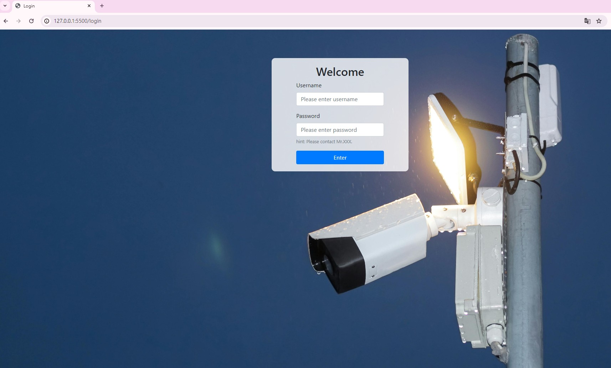

｜｜｜
# Web-Fire-Helmet-Detection


##啟動指令

   cd 至目標資料夾前一層，再輸入
```bash
   python web_flask.py
``` 

### 網頁設計(Frontend)

1. 登入頁面採用POST -> login.html && login.css

   - [x] Login  
   - [x] hint
   
   帳號密碼預設為:
   ```bash
   admin
   ```
   ```bash
   password
   ```
   

2. 主頁面引入串流並播放 -> design.html && design.css
   - [x] Video streaming  
   - [x] Video list
   - [x] Video player
   - [x] Logout

### 功能(Function)

1. Helmet_Detection

    利用YOLOv4模組對每個像素影像處理，對工地工人檢測是否有戴安全帽，並將檢測出的結果回傳。
2. Fire_Detection

    藉由OpenCV中的hsv火焰顏色範圍結合去背後的火焰剪影型態檢測出相機可視範圍內是否有火焰，並將檢測出的結果回傳。

#### 遇到的困難(difficult)
1. 錄製監視器畫面儲存失敗(解決用時:1 week)
	
    sol: 首先要能夠同步儲存必須用queue，並且在錄製影片停止時必須讓thread確認是否都結束，若結束的話就釋放資源，才會讓影像完整錄完存檔。

2. 錄製下的影片無法在網頁list中點擊後播放，但是可以在本機播放(2 day)
	
    sol: 因為網頁只接受h.264格式的mp4，所以我用ffmepg引入from moviepy.editor import VideoFileClip進行影片轉檔，就能在網頁中播放。

   參考資料:
   - [help 2-1](https://www.cnblogs.com/Yellow-ice/p/13743400.html)
     
   - [help 2-2](https://blog.csdn.net/qq_41494464/article/details/88664507)

4. 將轉檔後的影片以原檔名蓋過原檔，使用os.rename會產生"FileExistsError: [WinError 183] 當檔案已存在時，無法建立該檔案"的問題(3hr chatgpt...)。

    sol: 引入shutil函式庫，利用shutil.move強制覆蓋
   參考資料:
    - [help 3-1]( https://www.jianshu.com/p/f39a444dee46)
